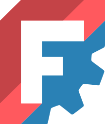

<h1 class="r-fit-text">FreeCAD: Votre propre modeleur 3D paramétrique</h2>

30/05/2026 - Journées Du Logiciel Libre, ENS Lyon

---
<!-- Exemple d'inclusion d'image -->

---

### Contexte

- Passage à l'échelle d'un projet non structuré vers un projet communautaire financé

---

### Présentation des intervenants: Louis Gombert
- Télécom INSA Lyon '23
- Ingénieur logiciel @ Kitware
- Contributeur régulier de FreeCAD

***

### Présentation des intervenants: Pierre-Louis Boyer

***

### Présentation des intervenants: Thomas D.

---

<!-- Thomas -->
### Nouveautés 1.1
- Transform tool
- Clarify selection
- Datum tools
- Esquisse: external geometry
- Previsualisations

***

### À venir 1.2
- async recompute
- Sketcher text tools
- mass properties
- refonte du moteur 3D de Coin: intégration du code, refactoring, changement du moteur de rendu

---

### Fonctionnement du projet
- Fonctionnement des groupes de travail
- Comment on en est arrivé là: de la formation à la formalisation
- on peut faire partie de plusieurs groupes à la fois
- on n’est pas obligé de faire partie d’un groupe pour participer au discussions

---

### Design working group: UI/UX
- Design system
- Revues de design

---

### Groupes de travail (WG)
- Fonctionnement des groupes de travail
- Historique: comment on en est arrivé là: de la formation à la formalisation

***

### Design WG
- on peut faire partie de plusieurs groupes à la fois
- on n’est pas obligé de faire partie d’un groupe pour participer au discussions
- Design working group: UI/UX
- Design system
- Revues de design

***

### CAD WG
- "on veut offrir un outil de niveau professionnel utilisable par tout le monde"

***
<!-- Louis -->
###  CQ WG
- Qualité de code globale pas incroyable, essayer de donner des règles à suivre; indépendant des mainteneurs
- En cours de formalisation (FEP)
- Infra WG : gèrent l'infrastructure (Wiki, site web...)

---
### FEP
 - Se mettre d'accord sur un changement majeur au niveau du projet
 - Le projet s'impose des contraintes sur ce qui va être fait

---

### Financements: FPA
- AISBL: entité juridique basée en Belgique, qui gère les donations du projet
- Gère des programmes de donations:
- Travel grants
- Jobs: mensualités versées. Pas un emploi, c'est une donation
- Grants pour des tâches spécifiques (Transform tools, Refonte du moteur 3D, toponaming)
- FreeCAD Day à Bruxelles
- Formations: UX par Obelisk
- Achats de standards

--- 
<!-- Thomas-->
### GSoC
- Projets potentiels proposés par la communauté
- Sélection du projet et de l'étudiant, proposé à Google
- Google sélectionne les projets et les finance
- Les résultats sont contribués au projet
- Projets de cette année:
- UI/UX Techdraw
- Esquisse 3D
- Atelier Robotique
- Faire communiquer assemblage, FEA, dynamique de plusieurs corops
- BIM buildingSMART

---
<!-- Louis -->
### Fonctionnement du projet/ PRs
- Processus de revues de code collaboratives, participation communautaire
- Rôles très variés dans la communauté:
    - Développeurs
    - Professionnels de la CAD
    - Formateurs
    - Rapporteurs d'issue

---

### Éclatement des plateformes de collaboration
- Historique: serveur Mantis
- Site web
- Forum
- Discord
- GitHub
- Futur: Discourse? Matrix? Codeberg?

---

<!-- Pierre-Lous-->
### Tentatives de commercialisation
- Ondsel: société américaine qui a tenté de développer une solution professionelle basée FreeCAD
- A reversé dans l'open source l'atelier assemblage, le serveur de collaboration
- A fermé depuis
- Propriété intellectuelle reversée au projet
- Initiative de personnes déjà dans la commauté, et qui y sont restés
- AstoCAD: soft-fork qui est une pré-visualisation de ce que pourrait être le projet

---

### Conclusion

---

### Questions ?

Slides: [slides.f4mkg.fr/jdll26](https://slides.f4mkg.fr/jdll26)

Code: [https://github.com/Lgt2x/jdll26](https://github.com/Lgt2x/jdll26)
